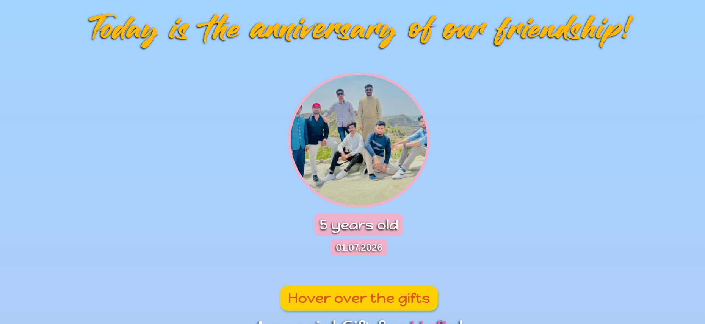
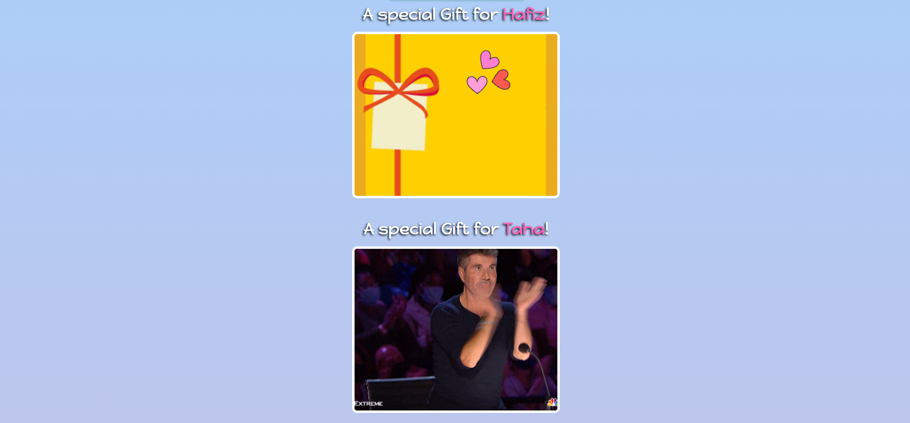
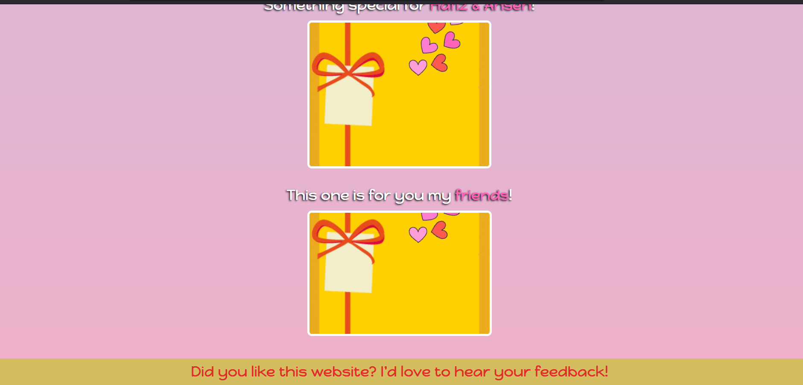

# Friendship Anniversary

A fun and interactive **Friendship Anniversary** webpage built with **HTML5** and **CSS3** to celebrate five years of friendship. The project features personalized gift sections, creative hover effects, smooth CSS animations, and a colorful modern design.

## Live Demo

Live demo will be available soon.

## Preview





## Features

- Friendship Anniversary landing page
- Personalized gift sections for each friend
- Interactive hover effects with GIF reveals
- Smooth slide-in animations using CSS keyframes
- Beautiful gradient background and modern UI
- Custom and Google Fonts
- Clean, responsive, and organized layout

## Built With

- HTML5
- CSS3
- Google Fonts
- Custom Fonts
- CSS Animations & Transitions

## Project Structure

```
Friendship-Anniversary/
│── images/
│── index.html
│── index.css
└── README.md
```

## Getting Started

1. Clone the repository:

```bash
git clone https://github.com/d-anyaal/friendship-anniversary.git
```

2. Open the project folder.

3. Run `index.html` in your browser.

## Purpose

This project was created to celebrate friendship in a fun and memorable way while improving front-end development skills with HTML and CSS.

## Author

**Danyaal Javed**

If you enjoyed this project, feel free to ⭐ the repository and share your feedback!
